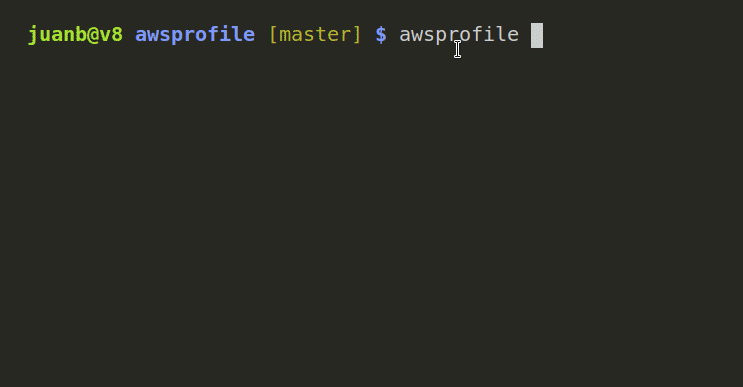

# awsprofile
Small and simple tool to set the current profile values for aws many CLI's


## INSTALL
execute:
```
go build 
```
or get the binary from releases

copy awsprofile to somewhere in your $PATH
in my case is $HOME/.local/bin
then to change the active profile
```
$(awsprofile)
aws sts get-caller-identity
```

Alternatively you can make an alias and put it in your .bashrc .zshrc or .profile depending the linux flavor and config
```
alias switchaws='$(awsprofile);aws sts get-caller-identity'
```
* NOTE:  the get-caller-identity is for ensuring you are on the right account and avoid you to mistakenly switch to the wrong account

and you're ready !!!
## Built With

* [Viper] (https://github.com/spf13/viper) - Go configuration with fangs!
* [termui] (https://github.com/gizak/termui) - a fully-customizable terminal dashboard and widget library 

## Contribute
All contributions are welcome open an issue or make a pr!

## License
This code is released under MIT license

## Acknolewdements
This tool is inspired by @ivours a coworker and a friend of mine
https://github.com/ivours/awsprofile